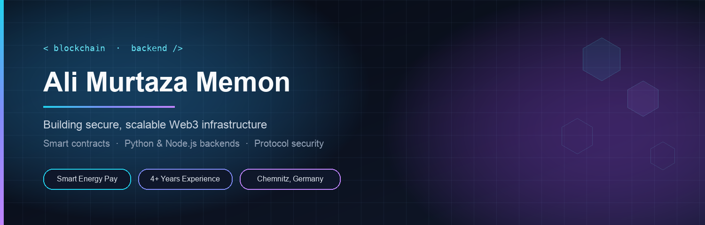

<div align="center">
  
</div>

<br />

<div align="center">
  
</div>

<br />

<div align="center">

[](https://alymurtazamemon.vercel.app/)
[](https://linktr.ee/alymurtazamemon)
[](https://www.linkedin.com/in/alymurtazamemon/)
[](https://twitter.com/alymurtazamemon)
[](mailto:alimurtaza-memon@outlook.com)

[](https://github.com/alymurtazamemon)
[](https://github.com/alymurtazamemon)
[](https://github.com/alymurtazamemon?tab=repositories)

</div>

<div align="center">
  
</div>

## About me

I design and ship **blockchain backends** and **smart contract systems** that have to hold up in production — not just in a demo. Over **4+ years** I have gone from full-stack product work into Ethereum protocol engineering, DeFi-adjacent infrastructure, and competitive smart-contract security.

Right now I am a **Blockchain Backend Developer at [Smart Energy Pay](https://www.linkedin.com/company/smartenergypay)**, building the systems behind a FinTech product that ties payments to real-world value. I am also completing an **M.Sc. in Web Engineering** at [TU Chemnitz](https://www.tu-chemnitz.de/) in Germany.

Before that I audited live contests on **Code4rena, CodeHawks, and Sherlock**, and I spent a year as a technical specialist on Patrick Collins’ Chainlink / freeCodeCamp Solidity course — reviewing PRs, unblocking learners, and keeping a huge open-source classroom moving.

- **Focus:** Solidity, Foundry / Hardhat, Python & Node.js backends, TypeScript, protocol security
- **Based in:** Chemnitz, Germany
- **Previously:** ESOLS Technologies (Flutter / Node / PostgreSQL)
- **Education:** B.E. Software Engineering, Mehran University · M.Sc. Web Engineering, TU Chemnitz

<div align="center">
  
</div>

## What I work on

<table>
<tr>
<td width="33%" valign="top">

### On-chain
Smart contracts, token mechanics, Merkle allowlists, social recovery, DAOs, and the tests that prove they behave.

</td>
<td width="33%" valign="top">

### Off-chain
APIs, indexers, and Node.js services that sit next to the chain — reliable, typed, and boring in the best way.

</td>
<td width="33%" valign="top">

### Security
Contest hunting, invariant thinking, and writing findings that other engineers can actually fix.

</td>
</tr>
</table>

<div align="center">
  
</div>

## Stack

**Languages & contracts**

<p>
  
</p>

**Backend, data & tooling**

<p>
  
</p>

**Interfaces when the product needs one**

<p>
  
</p>

<p>
  
  
  
  
  
  
</p>

<div align="center">
  
</div>

## Selected work

Public repos from learning and independent builds. Production work at Smart Energy Pay stays private under NDA.

Full public list: [linktr.ee/alymurtazamemon](https://linktr.ee/alymurtazamemon)

<table>
  <tr>
    <td width="50%" valign="top">
      <h3><a href="https://github.com/alymurtazamemon/my-accepted-audit-findings">Accepted audit findings</a></h3>
      <p>High / medium / QA / gas reports from Code4rena and CodeHawks contests — a public trail of how I actually hunt bugs.</p>
      <p>
        
        
        
      </p>
    </td>
    <td width="50%" valign="top">
      <h3><a href="https://github.com/alymurtazamemon/guardian-social-recovery-wallet-solidity">Guardian — social recovery wallet</a></h3>
      <p>Alchemy University final-week project. Recover a wallet through trusted guardians without giving up the keys in the happy path.</p>
      <p>
        
        
        
      </p>
    </td>
  </tr>
  <tr>
    <td width="50%" valign="top">
      <h3><a href="https://github.com/alymurtazamemon/nft-airdrop-solidity-react">NFT airdrop · Merkle allowlist</a></h3>
      <p>Unlimited off-chain allowlists, on-chain Merkle proofs, Pinata metadata. Live at <a href="https://nft-airdrop-solidity-react.vercel.app/">nft-airdrop-solidity-react.vercel.app</a>.</p>
      <p>
        
        
        
      </p>
    </td>
    <td width="50%" valign="top">
      <h3><a href="https://github.com/alymurtazamemon/decentralized-escrow-solidity-react">Decentralized escrow</a></h3>
      <p>Trust-minimized escrow with Solidity and a React UI — funds lock on-chain until both sides settle. Live at <a href="https://decentralized-escrow-solidity-react.vercel.app/">decentralized-escrow-solidity-react.vercel.app</a>.</p>
      <p>
        
        
        
      </p>
    </td>
  </tr>
  <tr>
    <td width="50%" valign="top">
      <h3><a href="https://github.com/alymurtazamemon/blockexplorer-clone-blockchain-react">Block explorer clone</a></h3>
      <p>A tight Etherscan-style explorer on the Alchemy SDK — blocks, txs, and account views without the noise.</p>
      <p>
        
        
      </p>
    </td>
    <td width="50%" valign="top">
      <h3><a href="https://github.com/alymurtazamemon/upgradable-smart-contracts-solidity">Upgradeable smart contracts</a></h3>
      <p>Transparent and UUPS proxy patterns with the OpenZeppelin Upgrades plugin — deploy, upgrade, and keep storage intact.</p>
      <p>
        
        
        
      </p>
    </td>
  </tr>
</table>

<div align="center">
  
</div>

## Path so far

```text
2026 —          Blockchain Backend Developer · Smart Energy Pay
2025 — 2026     Blockchain Backend · working student · Smart Energy Pay
2024 — 2026     Student Research Assistant · TU Chemnitz
2023 — 2024     Independent security researcher · Code4rena / CodeHawks / Sherlock
2022 — 2023     Blockchain consultant · Chainlink course community
2021 — 2022     Software engineer · Flutter, Node.js, PostgreSQL · ESOLS
2017 — 2021     B.E. Software Engineering · Mehran University
```

<div align="center">
  
</div>

## GitHub pulse

<div align="center">
  
  
</div>

<br />

<div align="center">
  
</div>

<br />

<div align="center">
  
</div>

<div align="center">
  
</div>

## A note from the community
> Ali has been incredibly helpful in helping answer questions in the 32-hour Hardhat / Solidity freeCodeCamp course. His empathy towards helping developers was an essential part of making sure the discussions went smoothly.
>
> — **Patrick Collins**, CEO & Co-Founder, Cyfrin

I still care about that part of the job: making hard systems understandable, and leaving the next engineer with a cleaner path than I had.

<div align="center">
  
</div>

<br />

<div align="center">
  <i>Secure by default. Typed where it matters. Shipped with tests.</i>
  <br /><br />
  Reach me: <a href="mailto:alimurtaza-memon@outlook.com">alimurtaza-memon@outlook.com</a>
  <br /><br />
  
</div>
